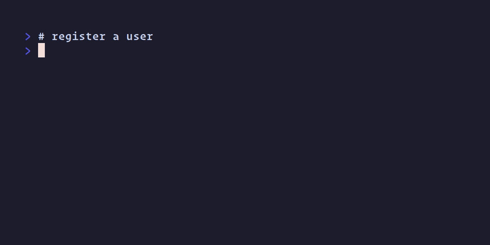

[](https://github.com/nixpig/syringe.sh/actions/workflows/build.yml?query=branch%3Amain)
[](https://coveralls.io/github/nixpig/syringe.sh?branch=main)
[](https://goreportcard.com/report/github.com/nixpig/syringe.sh)

# 🔐 `syringe.sh`

Encrypted key-value store over SSH.

> [!CAUTION]
> This is an experimental work in progress. **DO NOT** use to store sensitive data.



SSH (Secure Shell) is a cryptographic network protocol for secure communication between computers over an unsecured network that uses keys for secure authentication. If you've ever `ssh`'d into a remote machine or used CLI tools like `git` then you've used SSH.

syringe.sh uses SSH as the protocol for communication between the client (your machine) and the server (in the cloud).

Your public key is uploaded to the server. Your private key is then used to authenticate when you connect.

Data is encrypted locally using your private key before being sent to the server and stored in a separate database tied to your public key.

Data can only be decrypted locally using your private key. Without your private key, nobody can decrypt and read your data.

```
┌────────────────────────────────┐
│ STDIN                          │
│ syringe secret set SKEY s3cr3t │
└─────┬──────────────────────────┘
      │
  ┌───▼────────────────┐                        ┌─────────────────┐
  │      ┌────────────┐│       Encrypted        │┌───────┐        │
  │ CLI  │ 🔐 Encrypt ├─────────────────────────►│ Store │ Server │
  │      └────────────┘│          SSH           │└───┬───┘        │
  └────────────────────┘                        └────│────────────┘
                                                ┌────▼────┐
                                                │ User DB │┐  K: SKEY
                                                └┬────────┘│  V: <encrypted>
                                                 └─────────┘

┌─────────────────────────┐
│ STDIN                   │
│ syringe secret get SKEY │
└─────┬───────────────────┘
      │
  ┌───▼────────────────┐                        ┌─────────────────┐
  │      ┌────────────┐│       Encrypted        │┌───────┐        │
  │ CLI  │ 🔓️ Decrypt │◄─────────────────────────│ Store │ Server │
  │      └────┬───────┘│          SSH           │└───────┘        │
  └───────────│────────┘                        └────▲────────────┘
         ┌────▼─────┐                           ┌────│────┐
         │ STDOUT   │                           │ User DB │┐  K: SKEY
         │ s3cr3t   │                           └┬────────┘│  V: <encrypted>
         └──────────┘                            └─────────┘

```


## CLI

### Supported SSH key types

The following key types are supported for the syringe client.

- RSA


